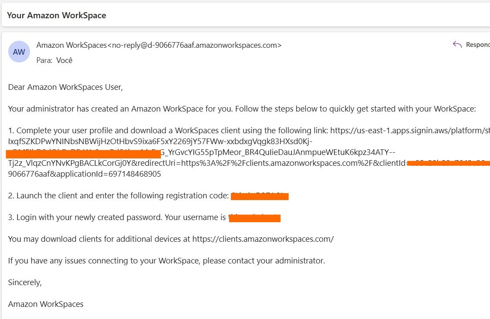
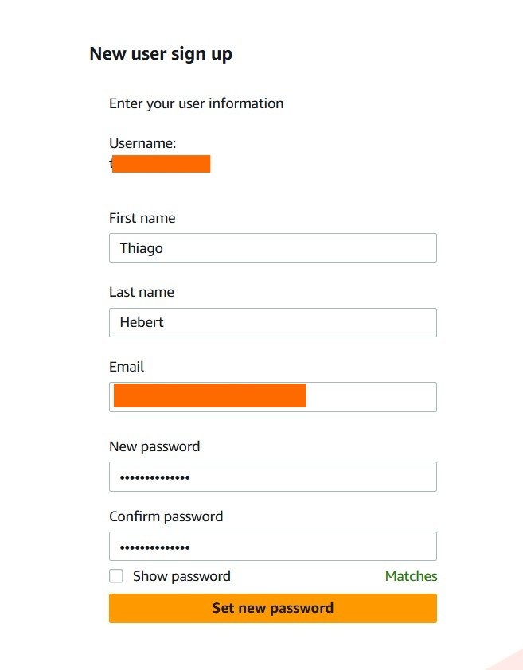
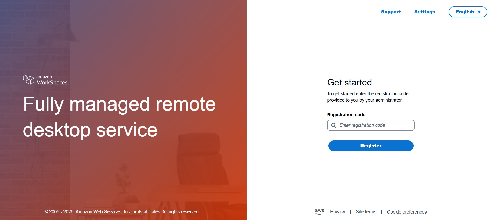
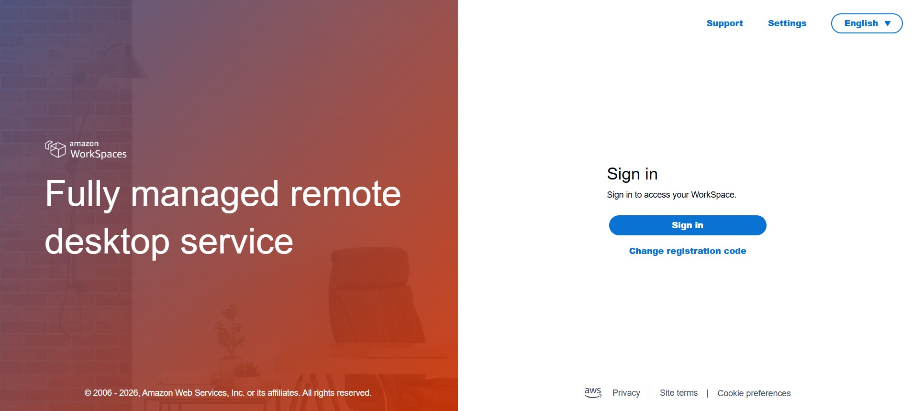
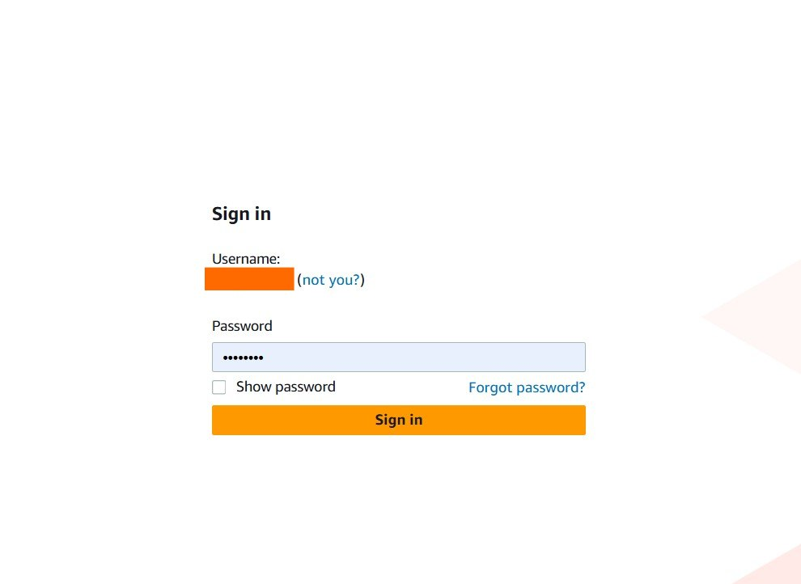
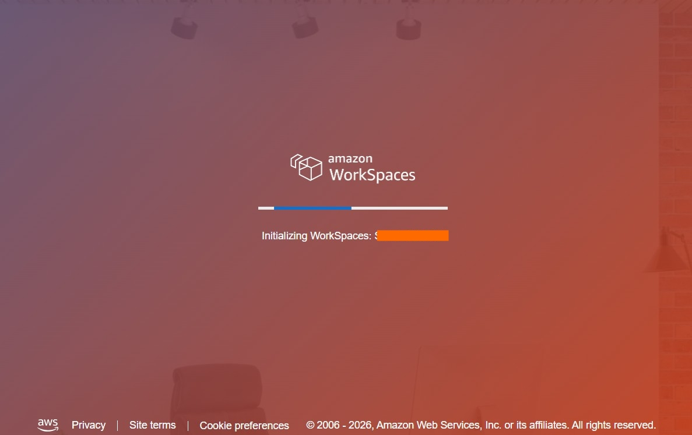
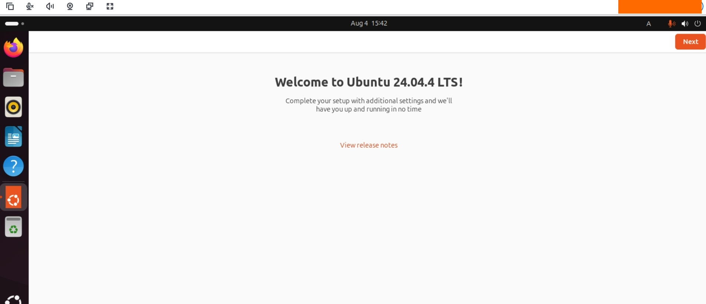

# CI&T — Anthropic Multi-Agent Workshop
## AWS Workspace Setup
---
This is a guide to setup your AWS Workspace environment, a virtual machine where you can run your workshop. Check requirements and details here: https://clients.amazonworkspaces.com/

## Step by Step

### Create your account
You will receive an e-mail with your invitation to complete your profile and a registration code. 

Follow the steps in this email, create a password, save your registration code and download the Workspace Client.
If you don't have permission to install in your computer, you can use the Web version, check if the URL are accessible from your computer: https://us-east-1.webclient.amazonworkspaces.com/

### Access the AWS Workspace

Access the client and type the **registration code**

After checking the registration code, you will be able to **login in your environment**

Wait for the environment to load

If you see this, you are all set :)

---