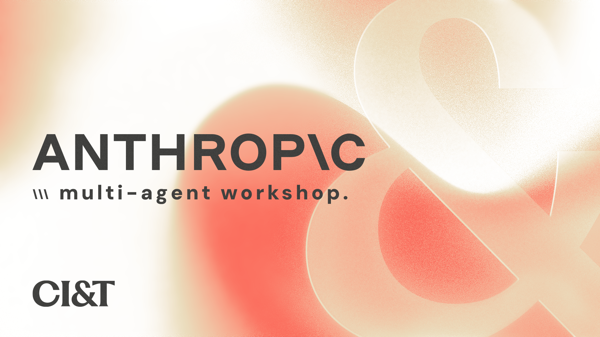
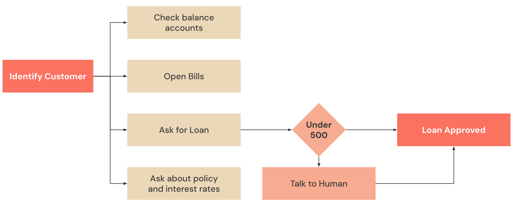

## Customer Support Agent

---

> **Workshop focus:** Everything you need to build is in `app/lib/agents/` — a handful of files you create during the sessions. The frontend, database, Docker infrastructure, and backoffice UI are **already set up and running** — they exist to make the agent feel real, not to be studied.
>
> The sections on Architecture, Tools, and the Agentic Loop are **informational reference**. The hands-on work is in [`WORKSHOP_STEPS.md`](WORKSHOP_STEPS.md).

---

## Table of Contents

1. [Project Overview](#1-project-overview)
2. [Schedule](#2-schedule)
3. [Architecture](#3-architecture)
4. [Coordinator Pattern](#4-coordinator-pattern)
5. [Tools](#5-tools)
6. [The Agentic Loop](#6-the-agentic-loop)
7. [Escalate to Human (Human-in-the-Loop)](#7-escalate-to-human-human-in-the-loop)
8. [MCP — Internal Document Search](#8-mcp--internal-document-search)
9. [Prompt Attack Prevention](#9-prompt-attack-prevention)
10. [Running the Project](#10-running-the-project)
11. [Database & API Contract](#11-database--api-contract)
12. [File Reference](#12-file-reference)

---


CorpBank is a fictional bank customer support system built to demonstrate **multi-agent AI patterns** using Claude via Amazon Bedrock. A customer chats with an AI agent that can query real data, handle loan requests, search internal policy documents, and transfer the conversation to a human agent in real time.

### What participants will learn

- How to call Claude and enforce structured JSON output with Zod
- Why the messages array is the only memory (Claude is stateless)
- How to define tool schemas so Claude knows when and how to use them
- How to implement the agentic loop — the `while` loop that keeps Claude working until it finishes
- How to build specialist agents and orchestrate them with a Coordinator
- How to connect an agent to external document sources via MCP
- How to escalate to a human agent with full context transfer in real time

### Stack

| Layer | Technology |
|---|---|
| Frontend | Next.js 14 + React + TypeScript |
| UI Components | shadcn/ui + Tailwind CSS |
| LLM | Claude via Amazon Bedrock (`@anthropic-ai/bedrock-sdk`) |
| Database API | SQLite + Express (Docker, port 3001) |
| Document search | MCP filesystem server via `supergateway` (Docker, port 8082) |
| Real-time | Server-Sent Events (SSE) |
| Validation | Zod |


---


| Step | Duration | What you build |
|---|---|---|
| 1 — Basic Agent | ~15 min | Single API call, system prompt, structured JSON output |
| 2 — Multi-turn Conversation | ~15 min | Understand statelessness and the messages array |
| 3 — Specialist Agents | ~25 min | CustomerData, Billing, Payments — each with own tools and loop |
| 4 — Orchestration | ~25 min | Coordinator delegates to specialists via tool-calling |
| 5 — MCP | ~20 min | Policy document search via MCP filesystem server |
| 6 — Human-in-the-Loop | ~20 min | Real-time handoff, backoffice, SSE |

**Total: ~2h**

---

  
&nbsp;  

---
&nbsp;  
  
&nbsp;  

### Pages

| URL | Who uses it | Purpose |
|---|---|---|
| `localhost:3000` | Customer | Chat with the AI agent |
| `localhost:3000/backoffice` | Human agent | See handoffs, chat with customer, approve/reject loans |
| `localhost:3000/db` | Developer | CRUD interface for the database |  

&nbsp;  
---


The **Coordinator** is a Claude agent that acts as the single entry point for customer requests. Instead of handling everything itself, it:

1. **Reads** the customer's message and conversation history
2. **Decides** which specialist agent should handle the request
3. **Delegates** by calling `delegate_customer_data`, `delegate_billing`, or `delegate_payments` as tools
4. **Synthesizes** the specialist responses into one coherent reply
5. **Escalates** when the request exceeds the agent's authority

The specialist agents (CustomerData, Billing, Payments) are themselves Claude instances, each with their own system prompt, tools, and agentic loop — scoped to their domain.

### Why a Coordinator instead of one big agent?

With a single flat agent, improving loan logic can accidentally break account balance behavior. Specialist agents are independently tunable. The Coordinator's behavior is controlled by:

- The **system prompt** — defines which agents exist and when to call them
- The **tool descriptions** — describe what each specialist handles
- The **conversation history** — gives context for routing decisions

### The coordinator's tools

```typescript
delegate_customer_data  → runs runCustomerDataAgent()  // identity, balances, transactions
delegate_billing        → runs runBillingAgent()        // bills and invoices
delegate_payments       → runs runPaymentsAgent()       // credit limits and loans
search_docs             → calls searchDocs() via MCP    // internal policy documents
escalate_to_human       → signals route.ts to create handoff + publish SSE event
```

> **The specialist agents are tools.** Calling another Claude agent uses the exact same tool-calling mechanism as calling a database. There is no special multi-agent API.

---


Tools are functions you expose to Claude. Claude reads the `name` and `description` and decides when to call them. You receive the call, execute the function, and return the result — Claude then continues.

### Tool definition anatomy

```typescript
{
  name: "get_accounts",
  description: "Returns all customer accounts (checking, savings, credit) with current balance.",
  input_schema: {
    type: "object",
    properties: { customer_id: { type: "string" } },
    required: ["customer_id"]
  }
}
```

> **The `description` is the most important field.** Claude never sees the implementation — only the description. A vague description leads to wrong or missing tool calls.

### Coordinator tools (what the Coordinator sees)

| Tool | Routes to | Purpose |
|---|---|---|
| `delegate_customer_data` | CustomerData Agent | Identity, account balances, transaction history |
| `delegate_billing` | Billing Agent | Open bills, overdue invoices, due dates |
| `delegate_payments` | Payments Agent | Credit limits, loan applications |
| `search_docs` | MCP filesystem | Internal policy documents (rates, fees, eligibility) |
| `escalate_to_human` | route.ts → SSE | Transfer conversation to a human agent |

### Specialist agent tools (what each specialist uses)

| Agent | Tools |
|---|---|
| CustomerData | `identify_customer`, `get_accounts`, `get_transactions` |
| Billing | `get_bills` |
| Payments | `get_credit`, `request_loan` |

### Credit limit enforcement

The Payments agent checks `get_credit` before processing any loan:

| Scenario | Agent behavior |
|---|---|
| Amount ≤ credit limit AND ≤ $500 | Call `request_loan` — auto-approved |
| Amount ≤ credit limit AND > $500 | Call `request_loan` as pending, ask confirmation, escalate if confirmed |
| Amount > credit limit | Decline, explain reason, offer exception via human |

---


The agentic loop is the `while (true)` that keeps Claude working until it finishes. Every specialist agent uses this pattern.

```typescript
while (true) {
  const response = await anthropic.messages.create({ model, system, tools, messages });

  if (response.stop_reason === "end_turn") {
    return extractText(response.content); // Claude finished — return the answer
  }

  if (response.stop_reason === "tool_use") {
    // Execute each tool Claude requested, feed results back, loop again
    messages.push({ role: "assistant", content: response.content });
    const results = await executeAllTools(response.content);
    messages.push({ role: "user", content: results });
  }
}
```

### `stop_reason` values

| Value | Meaning |
|---|---|
| `"end_turn"` | Claude finished — extract the text response |
| `"tool_use"` | Claude wants to call one or more tools — execute and loop |
| `"max_tokens"` | Response was cut off — increase `max_tokens` |

Without the loop, Claude requests a tool but your code never sends the result back, so Claude never composes the final answer.

---


When a loan requires human approval or a customer demands it, the Coordinator transfers the full conversation to a human agent (a **handoff**).

### Separation of concerns

The Coordinator **signals** escalation by capturing `escalation = input` when `escalate_to_human` is called. `route.ts` **executes** the infrastructure side: creating the database record and publishing the SSE event. This means changing from SSE to WebSockets, or swapping the database, requires no changes to the Coordinator.

### Handoff flow

```
1. Coordinator captures escalation signal
2. route.ts deduplicates — skips if a waiting handoff already exists for this conversation
3. route.ts resolves the customer record (by ID, then falls back to name+phone lookup)
4. POST /handoffs → CorpDB creates record with full conversation context
5. publish("*", handoff_created) → backoffice receives via SSE instantly
6. Customer chat enters "handoff mode" — messages go to human, not Claude
7. Human reads context, types reply → SSE pushes to customer chat in real time
8. Human approves/rejects → customer receives decision via SSE + suggested next steps
9. Human clicks "Return to AI" → handoff resolved, customer back to Claude
```

### Context passed to the human

Every handoff includes:
- Full conversation history
- Coordinator's internal reasoning (`thinking`)
- Customer summary (name, credit limit)
- Loan ID and amount (pre-filled in the decision form)

---


**Model Context Protocol (MCP)** is an open standard for connecting AI agents to external data sources without writing custom integrations for each one.

In this project, an MCP filesystem server exposes the `docs/` folder as a Docker container. When the customer asks about rates, fees, or policies, the Coordinator calls `search_docs` and returns accurate, sourced information.

### Documents

| File | Content |
|---|---|
| `docs/loan-policy.md` | Interest rates, repayment terms, eligibility, exception process |
| `docs/credit-limit-policy.md` | Default limits by account type, increase process |
| `docs/faq.md` | Common customer questions with official answers |
| `docs/products.md` | Account types, support channels |

### Infrastructure

The MCP server runs as a Docker container (`corpbank-mcp-docs`) using [supergateway](https://github.com/supercorp-ai/supergateway), which wraps `@modelcontextprotocol/server-filesystem` (stdio) and exposes it as **HTTP SSE** on port `8082`. The `docs/` folder is mounted as a read-only volume.

```
docker-compose.yml
└── mcp-docs (supercorp/supergateway)
      ├── wraps: npx @modelcontextprotocol/server-filesystem /docs
      ├── exposes: http://localhost:8082/sse  (SSE transport)
      └── volume: ../docs → /docs (read-only)
```

### How the MCP client works

```typescript
// Connects via SSE — Docker handles the stdio subprocess internally
const transport = new SSEClientTransport(new URL(MCP_DOCS_URL));
const client = new Client({ name: "corpbank-docs", version: "1.0.0" });
await client.connect(transport);

// List files and read content — identical calls regardless of the transport:
await client.callTool({ name: "list_directory", arguments: { path: "/docs" } });
await client.callTool({ name: "read_text_file", arguments: { path: "/docs/loan-policy.md" } });
```

> To connect to Google Drive, Notion, or Confluence instead — swap the Docker image and set `MCP_DOCS_URL` in `.env.local`. The agent code does not change.

---


| Mitigation | Implementation |
|---|---|
| Path traversal via LLM-generated IDs | `validateId()` checks `/^[a-zA-Z0-9_-]+$/` before every URL interpolation |
| PII in access logs | `identify_customer` uses `POST /customers/identify` — name and phone go in the body, not the URL |
| Backoffice endpoint auth | `x-backoffice-secret` header required for all human-action endpoints |
| Identity spoofing | `from` and `resolved_by` set server-side, never from client |
| Escalation scope | System prompt explicitly lists the two allowed escalation triggers |

---


### Prerequisites

- Node.js ≥ 18
- Docker + Docker Compose
- AWS account with Bedrock access (`AmazonBedrockFullAccess` IAM permission)

### Quickstart

```bash
# 1. Run setup — installs deps, starts Docker, creates .env.local template
./setup.sh

# 2. Add your Bedrock token to .env.local
# AWS_BEARER_TOKEN_BEDROCK=<your-token>

# 3. Start the app
npm run dev
```

### Environment variables (`.env.local`)

```bash
AWS_REGION=us-east-1
AWS_BEARER_TOKEN_BEDROCK=<your-token>
BACKOFFICE_SECRET=workshop
CORPDB_URL=http://localhost:3001
MCP_DOCS_URL=http://localhost:8082/sse
```

### Verify infrastructure

```bash
curl http://localhost:3001/health     # {"status":"ok"}
curl http://localhost:3001/customers  # returns the four seed customers
curl -s http://localhost:8082/sse     # MCP docs server — returns SSE stream
```

### URLs

| URL | Purpose |
|---|---|
| `http://localhost:3000` | Customer chat |
| `http://localhost:3000/backoffice` | Human agent backoffice |
| `http://localhost:3000/db` | Database CRUD |

### Test customers

| Name | Phone | Credit Limit | Good for |
|---|---|---|---|
| Alice Johnson | +1-555-0101 | $2,000 | Balance queries, open bills |
| Bob Smith | +1-555-0102 | $500 | Overdue bills, low credit |
| Carol Martinez | +1-555-0103 | $10,000 | VIP, large pending loans |
| David Lee | +1-555-0104 | $500 | Loan denial ($600 exceeds limit) |

### Session management

- **New session:** click "New session" in the chat header
- **Reset database:** `cd infra && docker compose down -v && docker compose up -d`

---


SQLite REST API (Docker, port 3001). Full contract: [`infra/API_CONTRACT.md`](infra/API_CONTRACT.md)

### Tables

| Table | Purpose |
|---|---|
| `customers` | Profiles: name, phone, credit_limit_usd |
| `accounts` | Balances: checking, savings, credit |
| `bills` | Bills with due dates and paid status |
| `transactions` | Account transaction history |
| `loans` | Requests with status: approved / pending / rejected |
| `pending_handoffs` | Handoff records with full conversation context |

### Key endpoints

```
POST /customers/identify            { name, phone }          ← preferred (PII in body)
GET  /customers/identify?name=&phone=                        ← legacy (PII in URL)
GET  /accounts/:customerId
GET  /bills/:customerId?paid=0
GET  /credit/:customerId
POST /loans                         { customer_id, amount }
POST /handoffs                      { conversation_id, customer_id, loan_id, context }
GET  /handoffs?status=waiting
PATCH /loans/:id/resolve            { decision, resolved_by, reason }
PATCH /handoffs/:id/resolve
```

---


```
customer-support-agent/
│
├── app/
│   ├── api/
│   │   ├── chat/route.ts              ← HTTP entry point — calls Coordinator, handles handoffs
│   │   ├── db/[...path]/route.ts      ← Proxy to CorpDB (avoids CORS in browser)
│   │   ├── handoff/route.ts           ← Human sends messages + approves/rejects loans
│   │   └── stream/route.ts            ← SSE endpoint (EventSource target)
│   ├── backoffice/page.tsx            ← Human agent UI
│   ├── db/page.tsx                    ← Database CRUD interface
│   └── lib/agents/
│       ├── coordinator.ts             ← Workshop stub → replace with Step 4 implementation
│       └── mcp-docs.ts                ← MCP client for document search (already complete)
│
├── tutorial/                          ← Reference implementations (read-only during workshop)
│   ├── customer-data.ts               ← CustomerData Agent — Step 3 solution
│   ├── billing.ts                     ← Billing Agent — Step 3 solution
│   ├── payments.ts                    ← Payments Agent — Step 3 solution
│   └── coordinator.ts                 ← Coordinator — Step 4 solution
│
├── components/
│   └── ChatArea.tsx                   ← Customer chat UI + SSE client
│
├── docs/                              ← CorpBank internal policy documents (MCP source)
│   ├── loan-policy.md
│   ├── credit-limit-policy.md
│   ├── faq.md
│   └── products.md
│
├── infra/
│   ├── docker-compose.yml             ← Starts CorpDB (3001) and MCP docs (8082) containers
│   ├── API_CONTRACT.md                ← Full REST API documentation
│   └── sqlite-api/
│       ├── server.js                  ← Express REST API
│       └── seed.js                    ← Schema + synthetic customer data
│
├── WORKSHOP_STEPS.md                  ← Step-by-step workbook (hands-on)
└── README.md                          ← Architecture reference (this file)
```
